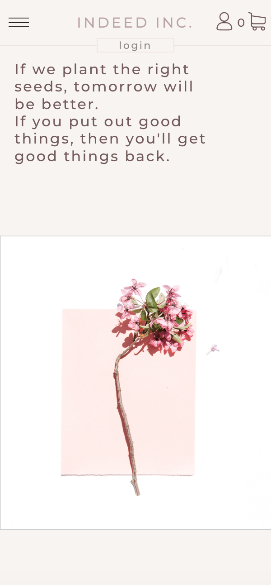
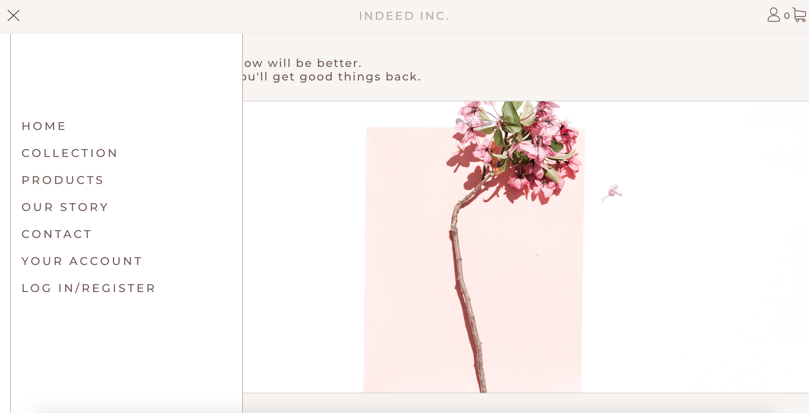

## e-commerce website project

This project was created with <b>React</b>, <b>Redux</b>, <b>Firebase</b> and <b>Styled components</b>.
It is a prototype of e-commerce page. It took me entire month to create whole project.   
Live demo: [indeed e-commerce](https://pages.github.com/). 

  Mobile: 
  

 Standard: 

### Other technologies used in this project:
- Storybook
- React reveal
- React spring
- Formik

